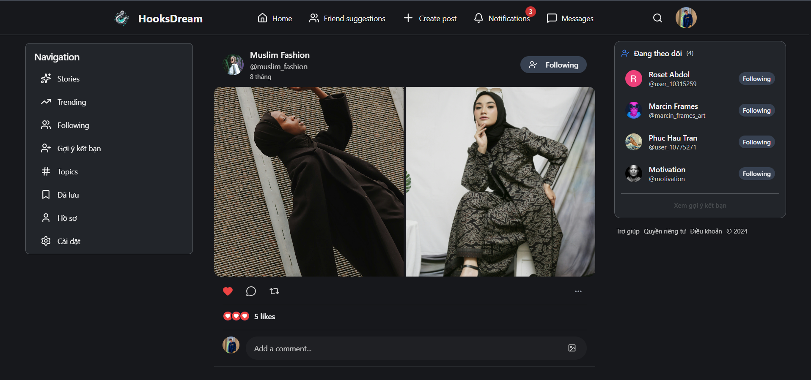
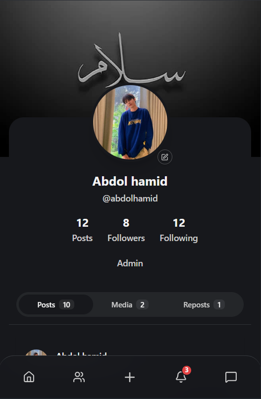

<div align="center">
  

# HooksDream

Modern social media platform inspired by Threads & X.
</div>


**HooksDream** is a modern social media platform built with a microservices architecture including Node.js backend, React frontend, and Python backend for AI/automation features.

[**🚀 Live Demo**](https://hooksdream.vercel.app) • [**📖 Documentation**](#) • [**🐛 Report Bug**](https://github.com/AbdolHamidDev/HooksDream/issues) • [**✨ Request Feature**](https://github.com/AbdolHamidDev/HooksDream/issues)

## 📸 Screenshots

<p align="center">
  
  
</p>

## Tech Stack

### Frontend
- **React 18** + **TypeScript** + **Vite**
- **Tailwind CSS** + **shadcn/ui** (Radix UI)
- **React Router DOM** - Navigation
- **TanStack Query** - State and cache management
- **Zustand** - State management
- **Socket.IO Client** - Real-time communication
- **React Hook Form** + **Zod** - Form handling and validation
- **i18next** - Internationalization
- **Framer Motion** / **React Spring** - Animations
- **Recharts** - Data visualization
- **PWA** (Vite PWA Plugin)

### Backend (Node.js - Express)
- **Express.js** - Web framework
- **MongoDB** + **Mongoose** - Database
- **Socket.IO** - Real-time bidirectional communication
- **JWT** (jsonwebtoken) - Authentication
- **Cloudinary** + **Multer** + **Sharp** - Image/video upload and processing
- **Node-cron** - Scheduled tasks
- **Web Push** - Push notifications
- **Express Rate Limit** - API rate limiting
- **Cheerio** - Web scraping

### Python Backend (FastAPI)
- **FastAPI** - High-performance API framework
- **Unsplash API** - Image sourcing
- **Bot Service** - Social media automation (Marcin bot)
- **AsyncIO** - Asynchronous task scheduling

### DevOps & Deployment
- **Docker** - Containerization
- **Railway** - Backend hosting (Node.js & Python)
- **Vercel / Netlify** - Frontend hosting

## Project Structure

```
HooksDream/
├── backend/                 # Node.js Backend (Express + MongoDB)
│   ├── server.js           # Entry point, initializes server and Socket.IO
│   ├── routes/             # API routes
│   │   ├── auth.js         # Registration, login, verification
│   │   ├── users.js        # User management
│   │   ├── posts.js        # Post management
│   │   ├── comments.js     # Comments
│   │   ├── follow.js       # User following
│   │   ├── chat.js         # Real-time messaging
│   │   ├── notifications.js # Notifications
│   │   ├── search.js       # Search
│   │   ├── storyRoutes.js  # Stories (temporary images/videos)
│   │   ├── friendDiscovery.js # Friend discovery
│   │   └── botRoutes.js    # Bot integration
│   ├── controllers/        # Business logic
│   ├── models/             # Mongoose schemas
│   ├── middleware/         # Auth, validation, rate limiting
│   ├── services/           # Background services (story archive)
│   ├── socket/             # Socket.IO server and handlers
│   └── utils/              # Helper functions
│
├── frontend/               # React Frontend (Vite + TypeScript)
│   ├── src/
│   │   ├── pages/          # Main pages
│   │   │   ├── FeedPage.tsx           # Home - Post feed
│   │   │   ├── CreatePostPage.tsx     # Create new post
│   │   │   ├── PostDetailPage.tsx     # Post details
│   │   │   ├── ProfilePage.tsx        # User profile page
│   │   │   ├── EditProfilePage.tsx    # Edit profile
│   │   │   ├── StoriesPage.tsx        # View stories
│   │   │   ├── MessagesPage.tsx       # Messages
│   │   │   ├── NotificationsPage.tsx  # Notifications
│   │   │   ├── SearchPage.tsx         # Search
│   │   │   ├── FriendPageRQ.tsx       # Friend requests
│   │   │   ├── MobileFriendPage.tsx   # Friends (mobile)
│   │   │   └── TermsOfUse.tsx         # Terms of use
│   │   ├── components/     # UI components
│   │   │   ├── auth/       # Login, Register, OTP
│   │   │   ├── chat/       # Chat interface
│   │   │   ├── comment/    # Comments
│   │   │   ├── createpost/ # Create post
│   │   │   ├── feed/       # Feed components
│   │   │   ├── layout/     # Main layout
│   │   │   ├── modals/     # Modals
│   │   │   ├── navigation/ # Navigation bar
│   │   │   ├── notifications/ # Notification components
│   │   │   ├── posts/      # Post components
│   │   │   ├── profile/    # Profile components
│   │   │   ├── search/     # Search components
│   │   │   ├── story/      # Story components
│   │   │   └── ui/         # shadcn/ui components
│   │   ├── contexts/       # React Contexts
│   │   ├── hooks/          # Custom hooks
│   │   ├── services/       # API services
│   │   ├── store/          # Zustand stores
│   │   ├── locales/        # i18n translations
│   │   └── utils/          # Utility functions
│   ├── package.json
│   ├── vite.config.ts
│   ├── tailwind.config.js
│   └── tsconfig.json
│
├── pyBackend/              # Python Backend (FastAPI)
│   ├── main.py            # Entry point, FastAPI app
│   ├── config.py          # Configuration and environment variables
│   ├── requirements.txt   # Python dependencies
│   ├── Dockerfile         # Docker config
│   ├── docker-compose.yml # Docker Compose
│   ├── routers/
│   │   └── bot_router.py  # Bot API endpoints
│   ├── services/
│   │   ├── unsplash_service.py  # Unsplash API integration
│   │   └── bot_service.py       # Marcin bot automation
│   └── data/              # Data storage
│
└── README.md
```

## Core Features

### Social Media Core
- **Registration / Login** - JWT authentication, OTP verification
- **Posts** - Create, edit, delete, like, comment, share
- **Stories** - Temporary images/videos (24h), auto archive
- **User Profiles** - View and edit personal information
- **Follow / Friends** - Follow system, friend requests
- **Real-time Chat** - Instant messaging via Socket.IO
- **Notifications** - Real-time notifications (like, comment, follow, message)
- **Search** - Search users and posts
- **Discovery** - Friend suggestions

### Advanced Features
- **Media Upload** - Image and video support with Cloudinary
- **Image Processing** - Sharp image processing, resize, optimize
- **Push Notifications** - Web Push API
- **Internationalization** - i18n support
- **PWA** - Progressive Web App, installable
- **Responsive Design** - Optimized for mobile and desktop
- **Rate Limiting** - API protection from abuse
- **Real-time Updates** - Socket.IO for live data

### AI & Automation (Python Backend)
- **Marcin Bot** - Social media interaction automation
- **Unsplash Integration** - High-quality images from Unsplash
- **Scheduled Tasks** - Auto post, scheduled interactions
- **Keep-alive Service** - Keep server active on Railway

## Installation and Setup

### Requirements
- Node.js >= 20.x
- Python >= 3.9
- MongoDB
- Cloudinary account
- Unsplash API key

### 1. Clone repository
```bash
git clone https://github.com/AbdolHamidDev/HooksDream.git
cd HooksDream
```

### 2. Install Backend (Node.js)
```bash
cd backend
npm install
```

Create `.env` file:
```env
MONGODB_URI=your_mongodb_uri
JWT_SECRET=your_jwt_secret
CLOUDINARY_URL=cloudinary://your_cloudinary_url
PORT=5000
NODE_ENV=development
```

Run backend:
```bash
npm run dev
```

### 3. Install Frontend (React)
```bash
cd frontend
npm install
```

Create `.env` file:
```env
VITE_API_URL=http://localhost:5000/api
VITE_SOCKET_URL=http://localhost:5000
```

Run frontend:
```bash
npm run dev
```

### 4. Install Python Backend
```bash
cd pyBackend
python -m venv venv
source venv/bin/activate  # Windows: venv\Scripts\activate
pip install -r requirements.txt
```

Create `.env` file:
```env
NODE_BACKEND_URL=http://localhost:5000
UNSPLASH_ACCESS_KEY=your_unsplash_key
BOT_ENABLED=true
ENVIRONMENT=development
```

Run Python backend:
```bash
python run.py
# or
uvicorn main:app --reload
```

## API Endpoints

### Authentication
- `POST /api/auth/register` - Register
- `POST /api/auth/login` - Login
- `POST /api/auth/verify-otp` - OTP verification
- `GET /api/auth/me` - Get current user info

### Users
- `GET /api/users/:id` - Get user info
- `PUT /api/users/:id` - Update user info
- `GET /api/users/:id/posts` - Get user posts

### Posts
- `GET /api/posts` - Get post feed
- `POST /api/posts` - Create new post
- `PUT /api/posts/:id` - Edit post
- `DELETE /api/posts/:id` - Delete post
- `POST /api/posts/:id/like` - Like post

### Comments
- `GET /api/comments/:postId` - Get comments
- `POST /api/comments` - Add comment
- `DELETE /api/comments/:id` - Delete comment

### Chat
- `GET /api/chat/conversations` - Get conversation list
- `GET /api/chat/messages/:userId` - Get messages
- `POST /api/chat/send` - Send message

### Stories
- `GET /api/stories` - Get active stories
- `POST /api/stories` - Create new story
- `DELETE /api/stories/:id` - Delete story

### Notifications
- `GET /api/notifications` - Get notifications
- `PUT /api/notifications/:id/read` - Mark as read

### Search
- `GET /api/search/users` - Search users
- `GET /api/search/posts` - Search posts

### Bot (Python Backend)
- `POST /api/bot/automate` - Run bot automation
- `GET /api/bot/status` - Check bot status
- `POST /api/bot/schedule` - Schedule post

## Socket.IO Events

### Client → Server
- `join` - Join chat room
- `sendMessage` - Send message
- `typing` - Typing indicator
- `markAsRead` - Mark as read

### Server → Client
- `newMessage` - New message
- `userTyping` - User typing
- `newNotification` - New notification
- `onlineUsers` - Online users list

## Useful Scripts

### Backend
```bash
npm start          # Run production
npm run dev        # Run development with nodemon
npm test           # Run tests
```

### Frontend
```bash
npm run dev        # Development server
npm run build      # Build production
npm run preview    # Preview production build
npm run lint       # ESLint check
```

### Python Backend
```bash
python run.py      # Run server
uvicorn main:app --reload  # Development with auto-reload
```

## Deployment

### Railway (Backend)
- Node.js backend: Deploy from `backend/` directory
- Python backend: Deploy from `pyBackend/` directory
- Use `Dockerfile` or Railway Nixpacks

### Vercel / Netlify (Frontend)
- Build command: `npm run build`
- Output directory: `dist`
- Configure environment variables for API URLs

## Environment Variables

### Backend (.env)
| Variable | Description | Required |
|----------|-------------|----------|
| `MONGODB_URI` | MongoDB connection string | Yes |
| `JWT_SECRET` | JWT signing secret | Yes |
| `CLOUDINARY_URL` | Cloudinary configuration | Yes |
| `PORT` | Server port | No (default: 5000) |
| `NODE_ENV` | Environment (development/production) | No |

### Frontend (.env)
| Variable | Description | Required |
|----------|-------------|----------|
| `VITE_API_URL` | Backend API URL | Yes |
| `VITE_SOCKET_URL` | Socket.IO server URL | Yes |

### Python Backend (.env)
| Variable | Description | Required |
|----------|-------------|----------|
| `NODE_BACKEND_URL` | Node.js backend URL | Yes |
| `UNSPLASH_ACCESS_KEY` | Unsplash API key | No |
| `BOT_ENABLED` | Enable/disable bot | No |
| `ENVIRONMENT` | Environment | No |

## Contributing

Contributions are what make the open source community such an amazing place to learn, inspire, and create. Any contributions you make are **greatly appreciated**.

### How to Contribute

1. **Fork the Project**
2. **Create your Feature Branch** (`git checkout -b feature/AmazingFeature`)
3. **Commit your Changes** (`git commit -m 'Add some AmazingFeature'`)
4. **Push to the Branch** (`git push origin feature/AmazingFeature`)
5. **Open a Pull Request**

### Contribution Guidelines

- Ensure your code follows the existing code style
- Write clear commit messages
- Update documentation if needed
- Add tests for new features
- Be respectful and inclusive in discussions

Please check out our [Contributing Guidelines](CONTRIBUTING.md) for more details.

## Code of Conduct

By participating in this project, you agree to maintain a respectful and inclusive environment. Please read our [Code of Conduct](CODE_OF_CONDUCT.md) before contributing.

## Security

We take security seriously. If you discover a security vulnerability, please follow our [Security Policy](SECURITY.md) to report it responsibly.

## License

This project is licensed under the MIT License - see the [LICENSE](LICENSE) file for details.

```
MIT License

Copyright (c) 2024 HooksDream

Permission is hereby granted, free of charge, to any person obtaining a copy
of this software and associated documentation files (the "Software"), to deal
in the Software without restriction, including without limitation the rights
to use, copy, modify, merge, publish, distribute, sublicense, and/or sell
copies of the Software, and to permit persons to whom the Software is
furnished to do so, subject to the following conditions:

The above copyright notice and this permission notice shall be included in all
copies or substantial portions of the Software.

THE SOFTWARE IS PROVIDED "AS IS", WITHOUT WARRANTY OF ANY KIND, EXPRESS OR
IMPLIED, INCLUDING BUT NOT LIMITED TO THE WARRANTIES OF MERCHANTABILITY,
FITNESS FOR A PARTICULAR PURPOSE AND NONINFRINGEMENT. IN NO EVENT SHALL THE
AUTHORS OR COPYRIGHT HOLDERS BE LIABLE FOR ANY CLAIM, DAMAGES OR OTHER
LIABILITY, WHETHER IN AN ACTION OF CONTRACT, TORT OR OTHERWISE, ARISING FROM,
OUT OF OR IN CONNECTION WITH THE SOFTWARE OR THE USE OR OTHER DEALINGS IN THE
SOFTWARE.
```

## Acknowledgments

- [React](https://reactjs.org/) - UI library
- [Express.js](https://expressjs.com/) - Backend framework
- [FastAPI](https://fastapi.tiangolo.com/) - Python API framework
- [MongoDB](https://www.mongodb.com/) - Database
- [Socket.IO](https://socket.io/) - Real-time communication
- [Tailwind CSS](https://tailwindcss.com/) - CSS framework
- [shadcn/ui](https://ui.shadcn.com/) - UI components
- [Cloudinary](https://cloudinary.com/) - Media management
- [Unsplash](https://unsplash.com/) - High-quality images

## Roadmap

- [x] Core social media features
- [x] Real-time chat and notifications
- [x] Stories functionality
- [x] Python backend for automation
- [ ] Dark mode
- [ ] Video calls
- [ ] Group chat
- [ ] Post scheduling
- [ ] Advanced analytics
- [ ] Content moderation AI
- [ ] Mobile apps (React Native)
- [ ] API documentation (Swagger/OpenAPI)
- [ ] GraphQL API

## Support

If you like this project, please give it a ⭐️ on GitHub!

- **Star** this repository if you find it useful
- **Fork** the project and submit pull requests
- **Report bugs** or **request features** via [Issues](https://github.com/AbdolHamidDev/HooksDream/issues)
- **Share** the project with others

## Contact

**AbdolHamidDev**

- 🌐 Portfolio: [https://hamid.id.vn](https://hamid.id.vn)
- 💼 LinkedIn: [www.linkedin.com/in/hamidabdol](https://www.linkedin.com/in/hamidabdol)
- 📧 Email: [abdolhamid.dev@gmail.com](mailto:abdolhamid.dev@gmail.com)
- ☕ Buy Me a Coffee: [https://buymeacoffee.com/hamidabdol](https://buymeacoffee.com/hamidabdol)

Project Link: [https://github.com/AbdolHamidDev/HooksDream](https://github.com/AbdolHamidDev/HooksDream)

Live Demo: [https://hooksdream.vercel.app](https://hooksdream.vercel.app)

---

<div align="center">
  <p>Made with ❤️ by <a href="https://hamid.id.vn">AbdolHamidDev</a></p>
  <p>
    <a href="https://github.com/AbdolHamidDev/HooksDream/stargazers">⭐ Star us on GitHub</a>
    •
    <a href="https://github.com/AbdolHamidDev/HooksDream/fork">🍴 Fork on GitHub</a>
    •
    <a href="https://buymeacoffee.com/hamidabdol">☴ Buy Me a Coffee</a>
  </p>
</div>
